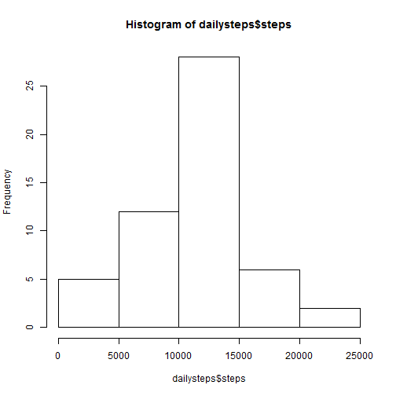
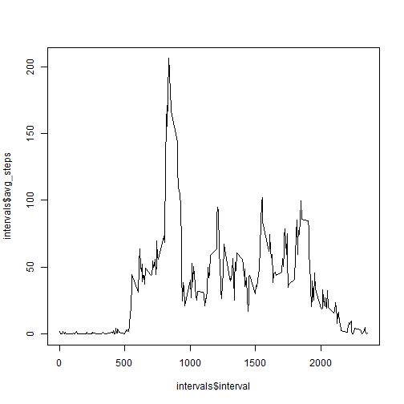
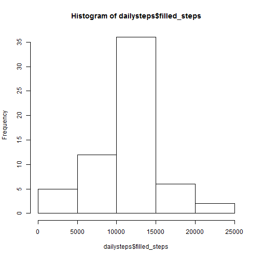
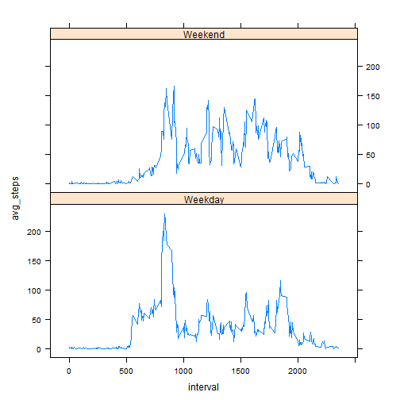

## Loading and preprocessing the data
First load any packages that will be used in the analysis


```r
library(dplyr)
library(lattice)
```

Load the data into memory. I'm assuming that the file is already downloaded and unzipped into the working directory.


```r
activ<-read.csv("activity.csv")
```

Process/transform the data (if necessary) into a format suitable for your analysis. I'm converting the dataframe to a table that can be used by the dplyr package. I'm also setting the format of the date column and creating a new date column that will remain a character vector (to group the data by day).


```r
activ<-tbl_dt(activ)
activ$date_char<-activ$date
activ$date<-as.Date(as.factor(activ$date_char),'%Y-%m-%d')
```

## What is mean total number of steps taken per day?
Calculate the total number of steps taken per day. I'm using the summarize function in the dplyr package to sum the steps taken each day. The data is stored in a new table called 'dailysteps'.


```r
dailysteps<-activ %>% group_by(date_char) %>% summarize(steps=sum(steps))
```

Make a histogram of the total number of steps taken each day


```r
hist(dailysteps$steps)
```

 

Calculate and report the mean and median of the total number of steps taken per day.


```r
meansteps<-dailysteps %>% summarize(daily.avg=mean(steps,na.rm=TRUE))
meadiansteps<-dailysteps %>% summarize(daily.med=median(steps,na.rm=TRUE))
print(paste("The mean number of steps per day is: ",round(meansteps$daily.avg[1])))
```

```
## [1] "The mean number of steps per day is:  10766"
```

```r
print(paste("The median number of steps per day is: ",round(meadiansteps$daily.med[1])))
```

```
## [1] "The median number of steps per day is:  10765"
```

## What is the average daily activity pattern?
Make a time series plot (i.e. type = "l") of the 5-minute interval (x-axis) and the average number of steps taken, averaged across all days (y-axis)


```r
intervals<-activ %>% group_by(interval) %>% summarize(avg_steps=mean(steps,na.rm=TRUE))
plot(intervals$avg_steps~intervals$interval, data=intervals,type='l')
```

 

Which 5-minute interval, on average across all the days in the dataset, contains the maximum number of steps?

```r
maxsteps<-intervals %>% filter(avg_steps==max(intervals$avg_steps,na.rm=TRUE))
print(paste("The interval with the max number of steps is interval ",round(maxsteps$interval)))
```

```
## [1] "The interval with the max number of steps is interval  835"
```

```r
print(paste("The number of steps in that interval is ",round(maxsteps$avg_steps)))
```

```
## [1] "The number of steps in that interval is  206"
```

## Imputing missing values
calculate and report the total number of missing values in the dataset (i.e. the total number of rows with NAs)

```r
missing<-nrow(filter(activ,is.na(steps)))
print(paste("There are ",missing," missing values in the data."))
```

```
## [1] "There are  2304  missing values in the data."
```

Create a new dataset that is equal to the original dataset but with the missing data filled in.
I'm using the average of each interval to fill in the missing values


```r
activ<-left_join(activ,intervals,by=c("interval"))
activ$filled<-ifelse(is.na(activ$steps),activ$avg_steps,activ$steps)
```

Make a histogram of the total number of steps taken each day and Calculate and report the mean and median total number of 
steps taken per day. Do these values differ from the estimates from the first part of the assignment? What is the impact of imputing missing data on the estimates of the total daily number of steps?


```r
dailysteps<-activ %>% group_by(date_char) %>% summarize(steps=sum(steps),filled_steps=sum(filled))
hist(dailysteps$filled_steps)
```

 

```r
meansteps<-dailysteps %>% summarize(daily.avg=mean(steps,na.rm=TRUE),daily.avg.filled=mean(filled_steps))
mediansteps<-dailysteps %>% summarize(daily.med=median(steps,na.rm=TRUE),daily.med.filled=median(filled_steps))
print(paste("Recall the average daily steps calculated earlier: ",round(meansteps$daily.avg[1])))
```

```
## [1] "Recall the average daily steps calculated earlier:  10766"
```

```r
print(paste("Here's the new average with the NAs filled in: ",round(meansteps$daily.avg.filled[1])))
```

```
## [1] "Here's the new average with the NAs filled in:  10766"
```

```r
print(paste("Recall the median daily steps calculated earlier: ",round(mediansteps$daily.med[1])))
```

```
## [1] "Recall the median daily steps calculated earlier:  10765"
```

```r
print(paste("Here's the new median with the NAs filled in: ",round(mediansteps$daily.med.filled[1])))
```

```
## [1] "Here's the new median with the NAs filled in:  10766"
```


## Are there differences in activity patterns between weekdays and weekends?
Create a new factor variable in the dataset with two levels - "weekday" and "weekend" indicating whether a given date is a weekday or weekend day.


```r
activ<-activ %>% mutate(weekday=weekdays(date),weekend=as.factor(ifelse(weekday=="Sunday" | weekday=="Saturday","Weekend","Weekday")))
```

Make a panel plot containing a time series plot (i.e. type = "l") of the 5-minute interval (x-axis) and the average number of steps taken, averaged across all weekday days or weekend days (y-axis). See the README file in the GitHub repository to see an example of what this plot should look like using simulated data.


```r
intervals2<-activ %>% group_by(weekend,interval) %>% summarize(avg_steps=mean(filled,na.rm=TRUE))
xyplot(avg_steps~interval|factor(weekend),data=intervals2,aspect=1/2,type="l")
```

 
